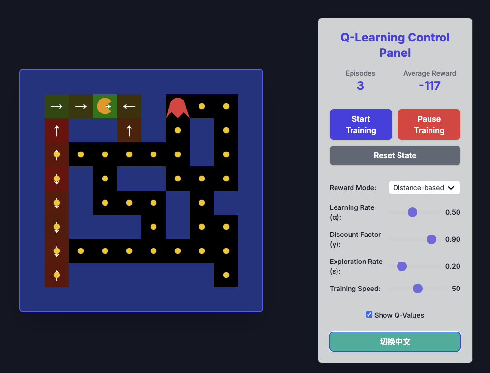

# ML Playground

A machine learning playground for experimenting with various ML models and techniques.

## 🎮 Web Demos

Open any HTML file in `visualizations/` in your browser.

### [Q-Learning Pac-Man Demo](/visualizations/pac-man/packman.html)

Interactive Q-Learning reinforcement learning demonstration featuring a Pac-Man agent learning to navigate a maze and collect dots while avoiding ghosts. Built with HTML5 Canvas and JavaScript, this demo showcases RL concepts including Q-value visualization, hyperparameter tuning, and training progress monitoring.

## Modeling Projects

#### [Generation Models](modeling/generation/README.md)

Image generation and reconstruction models including autoencoders, VAEs, and planned implementations of GANs, Stable Diffusion, and Diffusion Transformers (DiT).

#### [LLM Embedding](modeling/llm_embedding/README.md)

Sentence embedding learning using SimCSE approach.

#### [LLM Post Training](modeling/llm_post_training/README.md)

Docker-based environment for LLM post-training experiments.
