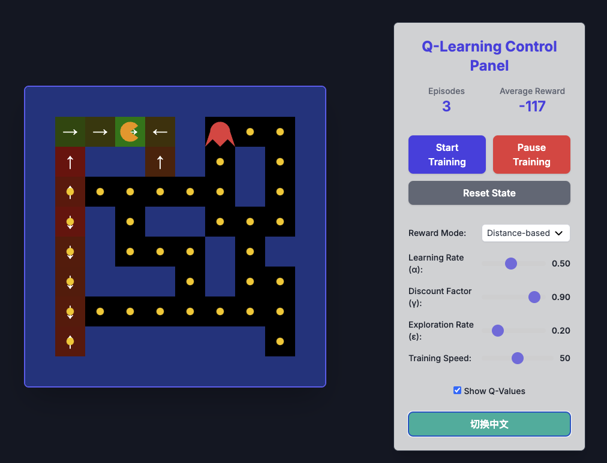

# ML Playground

A machine learning playground for experimenting with various ML models and techniques.

## Python Environment

This repo now uses a single `uv`-managed Python environment for everything under `modeling/` and `tests/`.

```bash
uv sync --extra dev
```

Run Python code through `uv run`, for example:

```bash
uv run pytest
uv run -m modeling.llm_embedding.training
uv run -m modeling.generation.ae.train_autoencoder
```

`scripts/` contains shell helpers and deployment utilities. `visualizations/` contains static web assets and is not part of the Python environment.

## 🎮 Web Demos

Open any HTML file in `visualizations/` in your browser.

### [Q-Learning Pac-Man Demo](/visualizations/pac-man/packman.html)

Interactive Q-Learning reinforcement learning demonstration featuring a Pac-Man agent learning to navigate a maze and collect dots while avoiding ghosts. Built with HTML5 Canvas and JavaScript, this demo showcases RL concepts including Q-value visualization, hyperparameter tuning, and training progress monitoring.



## Modeling Projects

#### [Generation Models](modeling/generation/README.md)

Image generation and reconstruction models including autoencoders, VAEs, and planned implementations of GANs, Stable Diffusion, and Diffusion Transformers (DiT).

#### [LLM Embedding](modeling/llm_embedding/README.md)

Sentence embedding learning using SimCSE approach.

#### [LLM Post Training](modeling/llm_post_training/README.md)

Docker-based environment for LLM post-training experiments.

#### [Attention Basics](modeling/basics/README.md)

Interview-friendly transformer attention implementations, including a hand-written multi-head attention module, a KV-cache decoding path, and small correctness/benchmark scaffolding.
