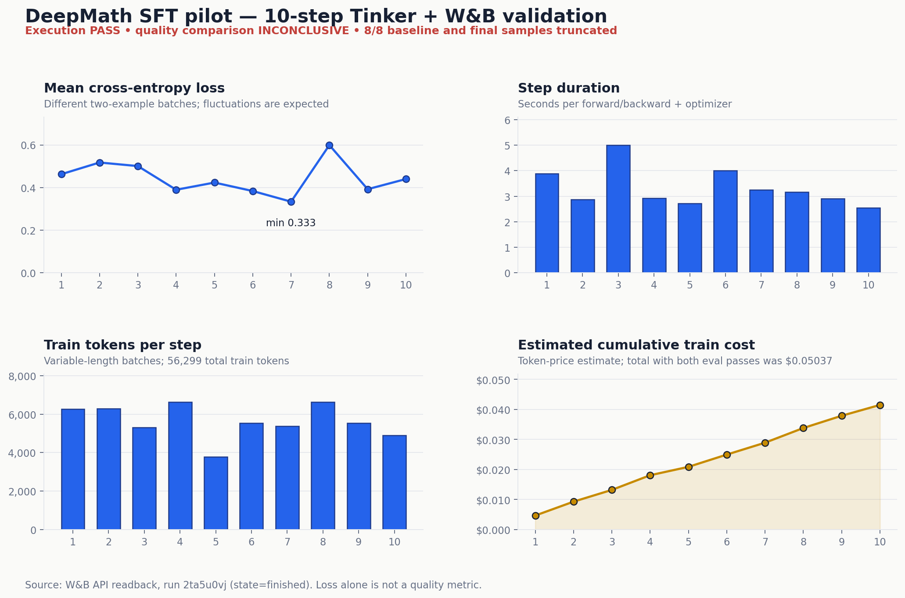

# DeepMath SFT 10-step validation — 2026-07-22

Result: **PASS** for the complete remote training path and **INCONCLUSIVE** for
model quality. The authorized run completed baseline evaluation, ten optimizer
updates, checkpoint persistence, trained-checkpoint evaluation, and W&B sync.
The quality comparison is invalid because all baseline and final samples hit
the configured 512-token output limit.

## Run identity

- Model: `Qwen/Qwen3.5-4B`
- Adaptation: rank-32 LoRA
- Optimizer: Adam, learning rate `1e-4`
- Dataset: `zwhe99/DeepMath-103K`
- Dataset revision: `5cf055d1fe3d7a2eb19719ac020211469736ae44`
- Prepared data: 64 train / 8 disjoint held-out eval examples
- Training: exactly 10 steps, 2 examples per step
- Evaluation: greedy matched baseline/final sampling, 512 output-token cap
- W&B run: [solar-firefly-3](https://wandb.ai/techtao-small-thinking/ml-playground-tinker/runs/2ta5u0vj)
- W&B entity/project: `techtao-small-thinking/ml-playground-tinker`
- W&B state after API readback: `finished`

## Observed training metrics

These rows were read back from the W&B API after the run finished.



| Step | Mean loss | Train tokens | Cumulative tokens | Step time (s) | Cumulative train cost (USD) |
| ---: | ---: | ---: | ---: | ---: | ---: |
| 1 | 0.462309 | 6,280 | 6,280 | 3.8835 | 0.004628 |
| 2 | 0.517339 | 6,283 | 12,563 | 2.8801 | 0.009259 |
| 3 | 0.500569 | 5,314 | 17,877 | 5.0062 | 0.013175 |
| 4 | 0.389315 | 6,634 | 24,511 | 2.9210 | 0.018065 |
| 5 | 0.423103 | 3,792 | 28,303 | 2.7256 | 0.020859 |
| 6 | 0.383300 | 5,544 | 33,847 | 4.0043 | 0.024945 |
| 7 | 0.333393 | 5,379 | 39,226 | 3.2448 | 0.028910 |
| 8 | 0.599094 | 6,643 | 45,869 | 3.1662 | 0.033805 |
| 9 | 0.391961 | 5,535 | 51,404 | 2.9143 | 0.037885 |
| 10 | 0.439744 | 4,895 | 56,299 | 2.5439 | 0.041492 |

Loss was noisy rather than monotonic because each step used a different pair
of variable-length examples. Mean loss was `0.444013`; the first-five mean was
`0.458527` and the last-five mean was `0.429498`. Ten batches are too few to
interpret that difference as convergence or model improvement.

## Evaluation result

| Metric | Baseline | Final checkpoint |
| --- | ---: | ---: |
| Exact-match accuracy | 0.0000 | 0.0000 |
| Accuracy among completed responses | 0.0000 | 0.0000 |
| Parser success rate | 1.0000 | 1.0000 |
| Completion rate | 0.0000 | 0.0000 |
| Truncation rate | 1.0000 | 1.0000 |
| Prompt tokens | 976 | 976 |
| Output tokens | 4,096 | 4,096 |

The `0.0 -> 0.0` accuracy is not evidence of no improvement. Every response
ended mid-reasoning at exactly 512 tokens, so the final-answer parser consumed
an incomplete last line. The matched comparison therefore fails its completion
guardrail and must be reported as inconclusive.

The live finding led to two changes in the same PR:

1. raise the future default evaluation limit from 512 to 2,048 tokens; and
2. require both baseline and final completion rates to reach a configurable
   `0.8` floor before `quality_comparison_valid` can be true.

Focused tests now cover max-length truncation, `score_completed`, and the
two-sided completion-rate validity gate. A second paid run was not made after
these changes.

## Tokens, cost, and checkpoints

- preflight maximum for the executed 10-step/512-token configuration:
  `$0.07401472`
- actual train tokens: `56,299`
- estimated train token cost: `$0.041492363`
- estimated total token cost including both eval passes: `$0.050369483`
- local hard stop: `$1.00`
- W&B runtime: approximately `109.2` seconds
- state checkpoint:
  `tinker://019367a1-e21e-5c74-9817-539f1f886a22:train:0/weights/deepmath-sft-mvp-2ta5u0vj-state`
- sampler checkpoint:
  `tinker://019367a1-e21e-5c74-9817-539f1f886a22:train:0/sampler_weights/deepmath-sft-mvp-2ta5u0vj-sampler`

The dollar values are local estimates from current public token prices, not a
provider billing record. Checkpoint storage is priced separately.

## Verification command

```bash
uv run --extra tinker python -m \
  modeling.llm_post_training.tinker.train_sft \
  --run --allow-paid --steps 10
```

The command exited successfully and the W&B API returned all ten metric rows,
the final summary, both checkpoint paths, and `state=finished`.

Regenerate the checked-in chart from the recorded W&B rows with:

```bash
MPLCONFIGDIR=/tmp/ml-playground-matplotlib uv run python \
  modeling/llm_post_training/tinker/validation/plot_deepmath_sft_metrics.py
```
